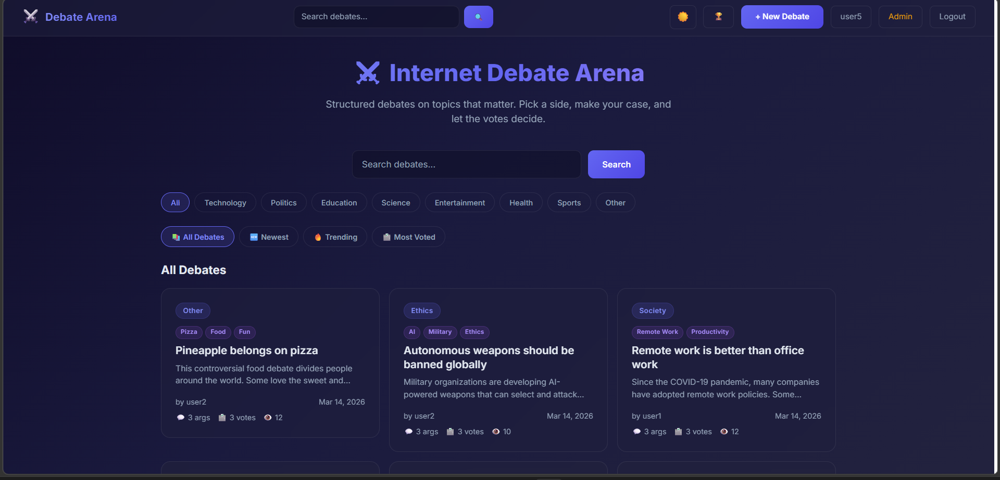
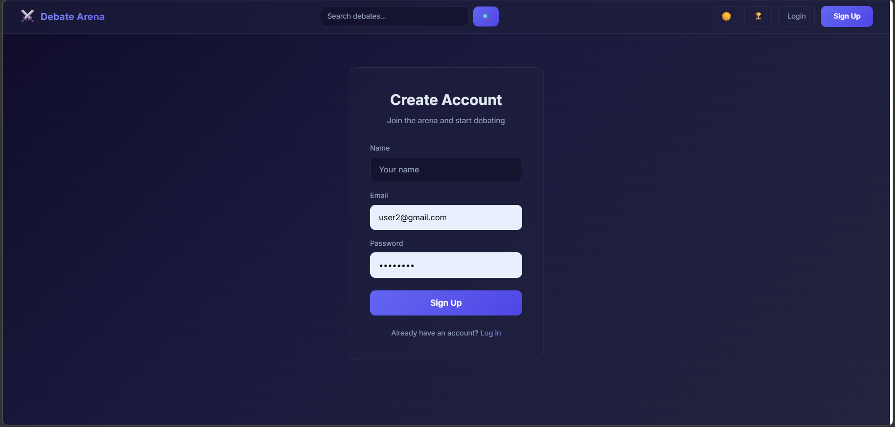
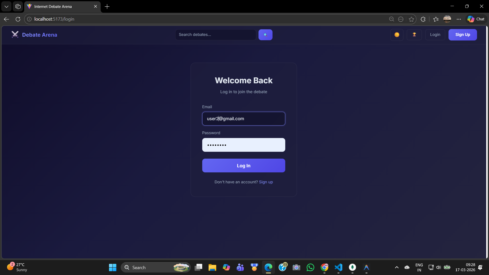
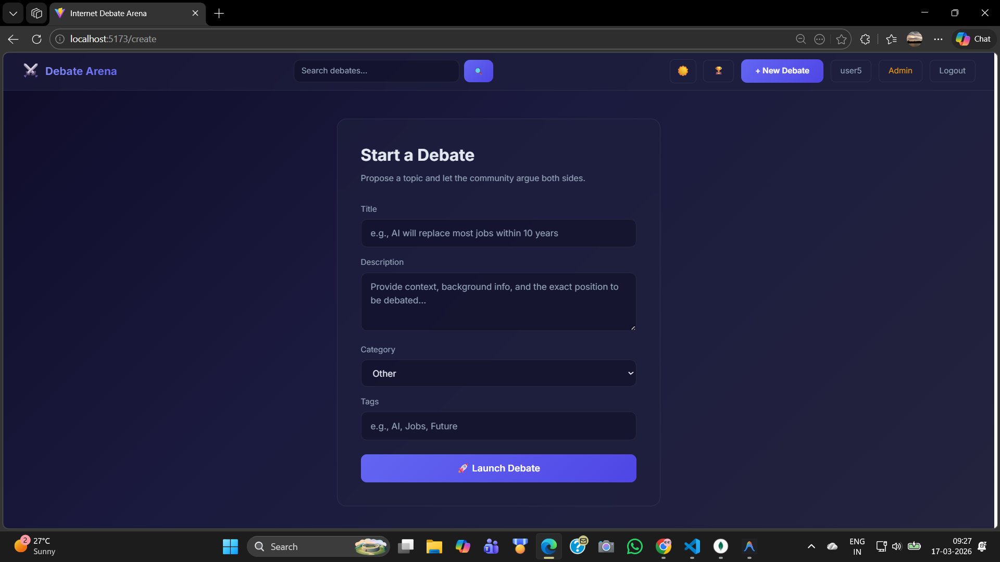
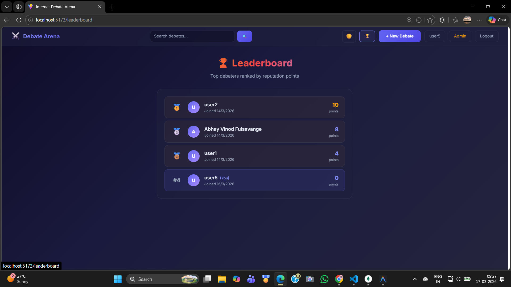
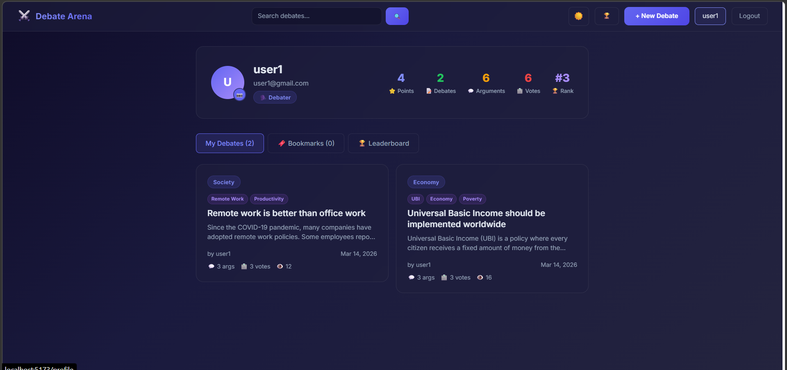
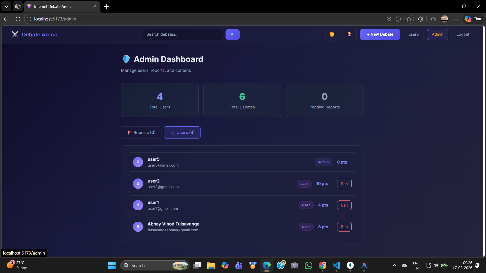

# 🌐 Internet Debate Arena

A full-stack **MERN debate platform** where users can create debate topics, argue on **Pro / Con sides**, vote on arguments, and engage in structured discussions.
The platform includes authentication, real-time interactions, moderation tools, bookmarking, and trending debates.

---
## 💡 Why This Project?

Internet Debate Arena is designed to promote structured discussions instead of random comment sections.  
It encourages users to think critically and present logical arguments on Pro/Con sides.

---
## 🏆 Key Highlights

* Real-time communication using Socket.io  
* Redis caching for high performance  
* Secure authentication using JWT  
* Admin moderation system  
* Scalable MERN architecture  

---
# 🚀 Features

### 👤 Authentication

* User registration and login
* Secure password hashing with bcrypt
* JWT-based authentication
* Protected routes

### 🗳️ Debate System

* Create debate topics
* Join debates with **Pro / Con arguments**
* Vote on debates
* View trending debates

### 💬 Arguments & Discussions

* Post arguments under debates
* Support for **Pro / Con sides**
* Real-time updates using Socket.io
* Reply to arguments

### ⭐ User Interaction

* Bookmark debates
* Like arguments
* Report inappropriate content

### 🛠 Admin Features

* View all users
* Moderate debates
* Remove abusive content
* Handle reports

### ⚡ Performance

* Redis caching for faster responses
* Pagination for large datasets
* Optimized API responses

### 🔒 Security

* Helmet for HTTP security headers
* CORS configuration
* Express-mongo-sanitize
* Rate limiting

---

# 🏗 Tech Stack

## Frontend

* React
* Vite
* React Router
* Axios
* Socket.io Client
* Tailwind (V4)

## Backend

* Node.js
* Express.js
* MongoDB
* Mongoose
* JWT Authentication
* Socket.io

## Other Tools

* Redis (caching)
* Winston (logging)
* Morgan (request logging)

---

# 📂 Project Structure

```
Internet-Debate-Arena
│
├── client                # React frontend
│   ├── src
│   │   ├── components
│   │   ├── pages
│   │   ├── hooks
│   │   ├── context
│   │   ├── services
│   │   └── socket
│   │
│   ├── package.json
│   └── vite.config.js
│
└── server                # Node.js backend
    ├── controllers
    ├── models
    ├── routes
    ├── middleware
    ├── config
    ├── socket
    ├── utils
    └── server.js
```

---

# ⚙️ Installation & Setup

## 1️⃣ Clone the repository

```
git clone https://github.com/abhayvf07/internet-debate-arena.git
cd internet-debate-arena
```

---

# 🔧 Backend Setup

```
cd server
npm install
```

Create `.env` file:

```
PORT=5050
MONGO_URI=YOUR_MONGODB_CONNECTION_STRING
JWT_SECRET=YOUR_SECRET_KEY
CLIENT_URL=YOUR_CLIENT_URL
REDIS_URL=YOUR_REDIS_URL
```

Run backend server:

```
npm run dev
```

---

# 💻 Frontend Setup

```
cd client
npm install
```

Create `.env` file:

```
VITE_API_URL=YOUR_API_URL
VITE_SOCKET_URL=YOUR_SOCKET_URL
```

Run frontend:

```
npm run dev
```

---
## 🔑 Demo Credentials

User:
email: user2@test.com  
password: Abhay@07   

Admin:
email: admin@test.com  
password: Abhay@07

---
# 🌍 Deployment

Push this repository to **GitHub** to store and share your code. From there, you can add a deployment workflow (e.g., GitHub Actions) or connect to a hosting provider of your choice.

---
# 📸 Screenshots

## 🏠 Home Page
splays trending debates, categories, and latest discussions.


## 🔐 Signup Page
User registration with secure authentication.


## 🔑 Login Page
Login system with JWT authentication.


## 🗳️ Create Debate
Users can create debates and choose Pro / Con topics.


## 📊 Leaderboard
Shows top contributors based on activity and engagement.


## 👤 User Profile
Displays user information, debates, and contributions.


## 🛡️ Admin Dashboard
Admin panel for managing users, debates, and reports.


---
## 📡 API Overview

| Method | Endpoint | Description |
|--------|--------|------------|
| POST | /api/auth/register | Register |
| POST | /api/auth/login | Login |
| GET | /api/debates | Get debates |
| POST | /api/debates | Create debate |

---
# 📊 Future Improvements

* AI moderation for abusive content
* Debate ranking algorithm
* User reputation system
* Notifications for replies
* Debate analytics

---

# 🤝 Contributing

Pull requests are welcome.
For major changes, please open an issue first to discuss improvements.

---
# 📄 License

---
## 👨‍💻 Author

**Abhay Fulsavange**

🔗 GitHub: https://github.com/abhayvf07

---

⭐ If you like this project, consider giving it a **star on GitHub**!
