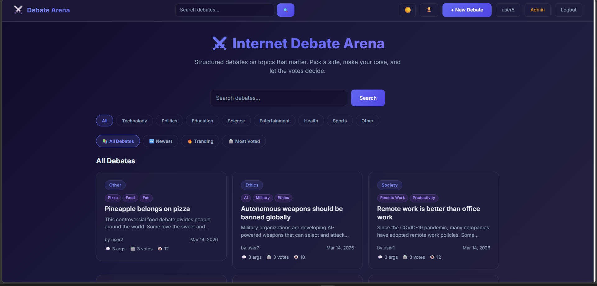
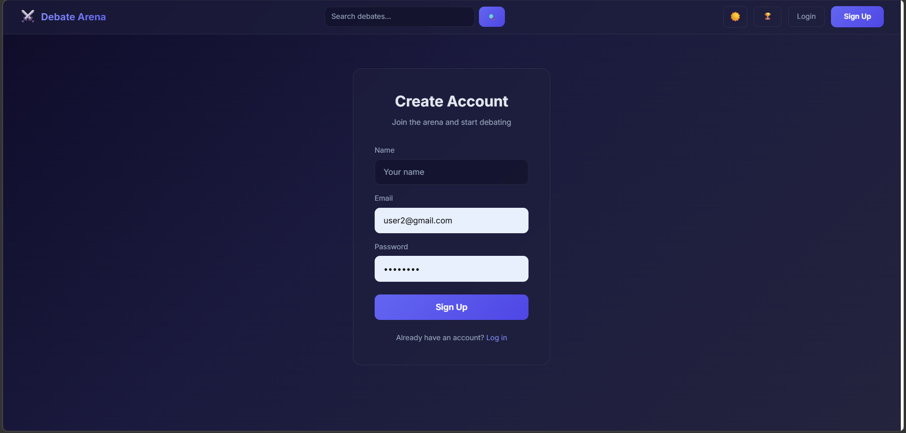
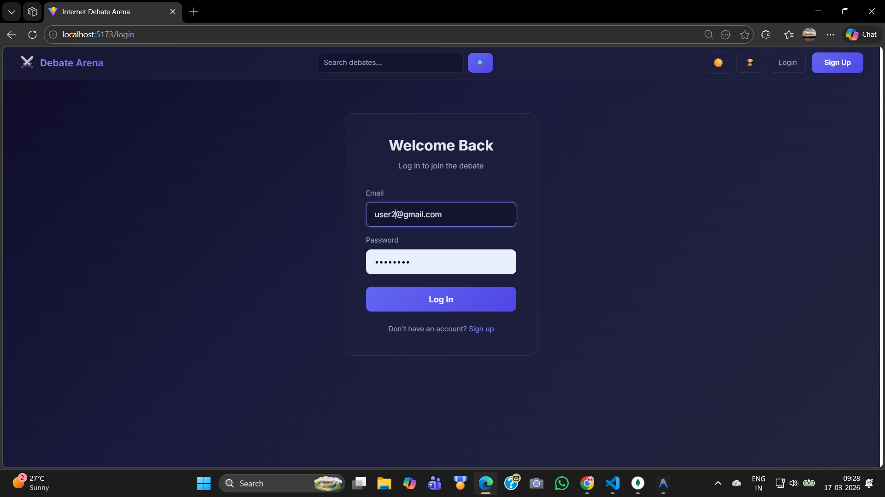
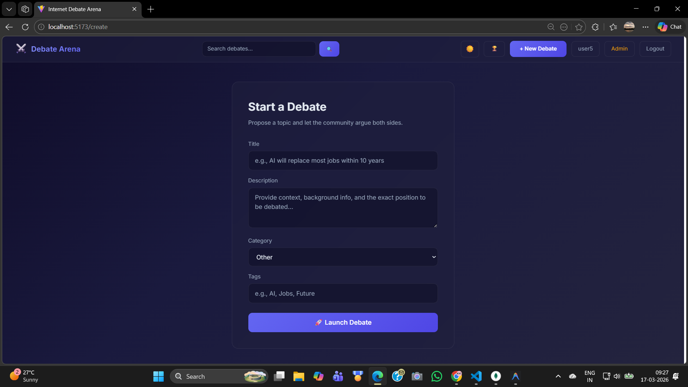
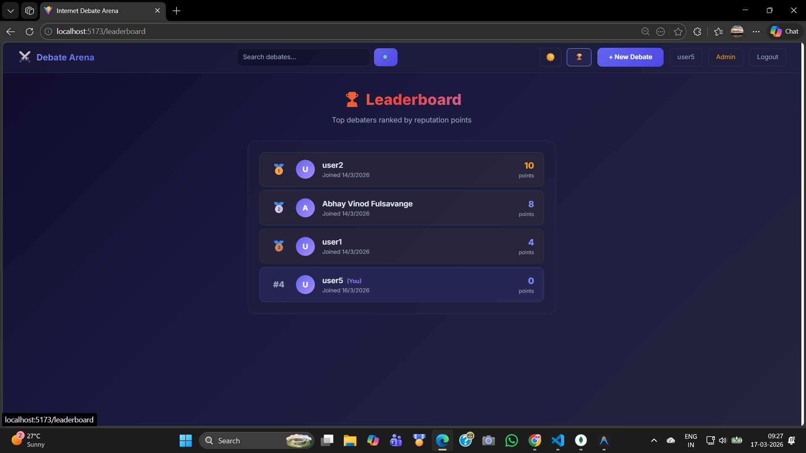
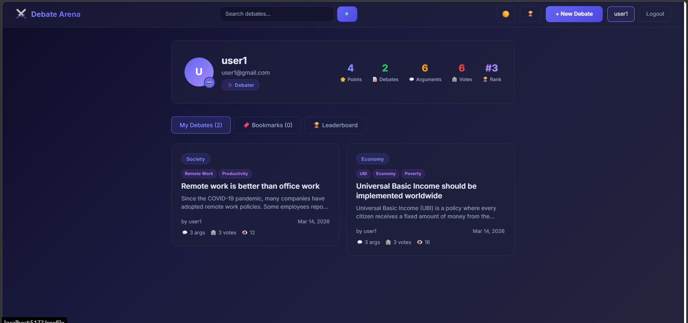
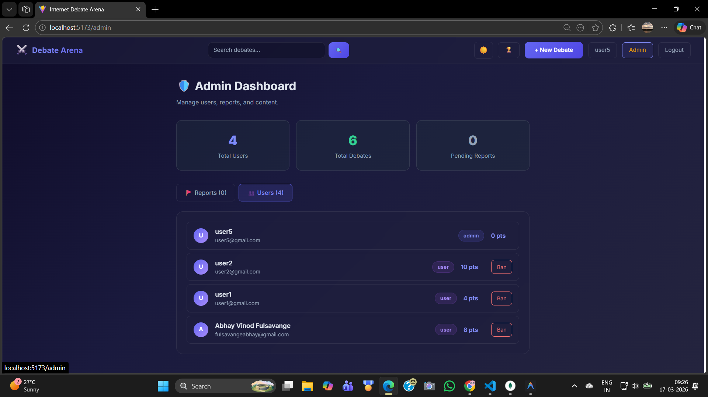

# Internet Debate Arena

A full-stack debate platform I built using the MERN stack where users can create debate topics, pick a side (Pro or Con), post arguments, vote, and engage in structured discussions. It also has real-time updates via Socket.io, Redis caching, JWT auth, admin moderation, bookmarks and a trending system.

---

## 🔗 Live Demo

| | Link |
|---|---|
| **Frontend** | [https://internet-debate-arena.vercel.app](https://internet-debate-arena.vercel.app) |
| **Backend API** | [https://internet-debate-arena.onrender.com](https://internet-debate-arena.onrender.com) |

---

## Why I Built This

I always felt like online comment sections are just chaos — people talking past each other with no structure. I wanted to build something that actually encourages people to think and present their side clearly. So I made a platform where every debate has two defined sides and you have to actually argue for one.

Beyond the idea itself, this project pushed me to learn a lot of things I hadn't touched before — Socket.io for real-time features, Redis for caching, service-layer backend architecture, and proper JWT refresh token flows. It was challenging but I learned more from this than from anything else I've built.

---

## Key Things I Built Into This

- Real-time argument and vote updates using Socket.io
- Redis caching so the API doesn't hammer the database on every request (and the app still works fine if Redis is down)
- JWT auth with access + refresh tokens, SHA-256 hashed token storage
- Admin panel to manage users, debates, reports and bans
- Auto-calculated trending score based on votes, arguments, views and age
- Modular service-layer backend — controllers are thin, all business logic lives in services

---

## Features

### Authentication
- Register and login
- Passwords hashed with bcryptjs
- JWT access tokens (JSON body) + refresh tokens (secure HttpOnly cookies)
- Protected routes on both client and server side

### Debate System
- Create debates with title, description, category and tags
- Join on Pro or Con side
- Vote with toggle support — you can switch sides or remove your vote
- View trending and latest debates
- Filter by category or tag, with pagination
- Trending score auto-calculated from votes, arguments, views and how old the debate is

### Arguments & Discussions
- Post arguments under any debate (Pro or Con)
- Reply to arguments — supports nested threaded structure
- Real-time updates — new arguments and vote changes broadcast instantly via Socket.io
- Like arguments — authors earn points for every like they receive

### User Features
- Bookmark debates to read later
- Like / unlike arguments
- Report inappropriate arguments
- User profile showing stats — debates created, arguments posted, votes received
- Points-based leaderboard

### Admin Features
- View and manage all users with pagination
- Ban or unban users (invalidates their sessions automatically)
- Deep recursive cascade cleanup for deleted arguments (ensures no orphaned replies, likes, or reports are left behind)
- Handle user reports — view pending ones and mark them resolved
- Admin dashboard with platform-wide stats

### Performance & Security
- Strict environment variable validation at startup to prevent silent security downgrades
- Redis caching with TTL — auto-invalidated on writes
- App degrades gracefully if Redis is unavailable
- Pagination on all large data sets
- Helmet for HTTP security headers
- CORS restricted to CLIENT_URL only
- express-mongo-sanitize against NoSQL injection
- xss-clean against XSS attacks
- Rate limiting — 5 req/min auth, 50 req/min votes/likes, 100 req/min general
- Joi validation on all request schemas
- Clean, well-documented codebase with uniform docstrings
- Morgan HTTP logging + console logging
- Cloudinary for cloud avatar storage (via Multer middleware — auto-resized to 256×256, persisted on CDN)

---

## Tech Stack

### Frontend
| Technology | Version |
|---|---|
| React | ^19.2.0 |
| Vite | ^7.3.1 |
| React Router DOM | ^7.13.1 |
| TanStack React Query | ^5.90.21 |
| Axios | ^1.13.6 |
| Socket.io Client | ^4.8.3 |
| Tailwind CSS | ^4.2.1 |
| Chart.js + react-chartjs-2 | ^4.5.1 / ^5.3.1 |
| React Hot Toast | ^2.6.0 |

### Backend
| Technology | Version |
|---|---|
| Node.js | LTS (v18+) |
| Express.js | ^4.21.0 |
| MongoDB + Mongoose | ^8.6.0 |
| Socket.io | ^4.8.3 |
| ioredis | ^5.10.0 |
| JWT (jsonwebtoken) | ^9.0.2 |
| bcryptjs | ^2.4.3 |
| Multer | ^2.1.1 |
| Joi | ^18.0.2 |
| Helmet | ^8.1.0 |
| express-rate-limit | ^8.3.1 |
| express-mongo-sanitize | ^2.2.0 |
| xss-clean | ^0.1.4 |
| Morgan | ^1.10.1 |
| Cloudinary | ^2.10.0 |
| multer-storage-cloudinary | ^4.0.0 |

---

## Project Structure

```
Debate Arena/
│
├── client/                        # React frontend (Vite)
│   ├── public/
│   ├── src/
│   │   ├── components/            # Reusable UI components
│   │   │   ├── ArgumentCard.jsx
│   │   │   ├── CategoryFilter.jsx
│   │   │   ├── DebateAnalytics.jsx
│   │   │   ├── DebateCard.jsx
│   │   │   ├── ErrorBoundary.jsx
│   │   │   ├── LoadingSpinner.jsx
│   │   │   ├── Navbar.jsx
│   │   │   ├── Pagination.jsx
│   │   │   ├── ProtectedRoute.jsx
│   │   │   ├── ReplySection.jsx
│   │   │   ├── ScoreBar.jsx
│   │   │   ├── SkeletonLoader.jsx
│   │   │   └── VoteButtons.jsx
│   │   ├── context/               # React context providers
│   │   │   ├── AuthContext.jsx
│   │   │   └── ThemeContext.jsx
│   │   ├── hooks/                 # Custom hooks
│   │   │   └── useAuth.js
│   │   │   └── useTheme.js
│   │   ├── layouts/
│   │   │   └── MainLayout.jsx
│   │   ├── pages/                 # Route-level page components
│   │   │   ├── AdminDashboard.jsx
│   │   │   ├── CreateDebate.jsx
│   │   │   ├── DebatePage.jsx
│   │   │   ├── Home.jsx
│   │   │   ├── Leaderboard.jsx
│   │   │   ├── Login.jsx
│   │   │   ├── Profile.jsx
│   │   │   └── Register.jsx
│   │   ├── services/
│   │   │   └── api.js             # Axios instance, all API calls & token refresh interceptor
│   │   ├── socket/
│   │   │   └── socket.js          # Socket.io client singleton & room helpers
│   │   ├── utils/
│   │   │   └── helpers.js         # formatDate, truncateText, getInitials
│   │   ├── App.jsx                # Router, lazy loading, context providers
│   │   ├── index.css              # Global styles + Tailwind directives
│   │   └── main.jsx               # React DOM entry + QueryClient setup
│   ├── .env
│   ├── eslint.config.js
│   ├── index.html
│   ├── package.json
│   └── vite.config.js
│
└── server/                        # Express.js backend
    ├── config/
    │   ├── db.js                  # MongoDB connection via Mongoose
    │   └── redis.js               # ioredis client + getCache / setCache / deleteCache helpers
    ├── controllers/               # Thin request/response handlers — delegate to services
    │   ├── adminController.js
    │   ├── argumentController.js
    │   ├── authController.js
    │   ├── bookmarkReportController.js
    │   └── debateController.js
    ├── middleware/
    │   ├── adminMiddleware.js     # role === 'admin' guard
    │   ├── authMiddleware.js      # JWT verify + banned-user check → req.user
    │   ├── cacheMiddleware.js     # Redis TTL cache intercept for GET routes
    │   ├── errorMiddleware.js     # Global error handler + asyncHandler wrapper
    │   ├── joiValidator.js        # Joi schema validation middleware factory
    │   └── uploadMiddleware.js    # Multer + Cloudinary config for avatar uploads
    ├── models/                    # Mongoose schemas & indexes
    │   ├── Argument.js
    │   ├── Bookmark.js
    │   ├── Debate.js
    │   ├── Like.js
    │   ├── Report.js
    │   ├── User.js
    │   └── Vote.js
    ├── routes/
    │   ├── adminRoutes.js
    │   ├── argumentRoutes.js
    │   ├── authRoutes.js
    │   ├── bookmarkRoutes.js
    │   ├── debateRoutes.js
    │   ├── reportRoutes.js
    │   └── userRoutes.js
    ├── services/                  # All business logic lives here
    │   ├── adminService.js
    │   ├── argumentService.js
    │   ├── authService.js
    │   ├── bookmarkService.js
    │   ├── debateService.js
    │   └── reportService.js
    ├── socket/
    │   └── index.js               # Socket.io server init, JWT auth, debate rooms
    ├── utils/
    │   ├── generateTokens.js      # generateAccessToken (15m) + generateRefreshToken (7d)
    │   └── pagination.js          # Reusable paginate() helper for Mongoose queries
    ├── validators/
    │   ├── argumentValidator.js
    │   ├── authValidator.js
    │   └── debateValidator.js
    ├── .env
    ├── package.json
    └── server.js                  # Entry point — middleware stack, routes, server startup
```

---

## System Design & Architecture

When designing this platform, I wanted to go beyond a basic CRUD app and build something that felt snappy and could handle real traffic without immediately choking the database. Here's a high-level look at how the pieces fit together:

- **Client Layer (React + Vite):** The frontend relies heavily on `React Query` to cache server responses and reduce network waterfalls. Global state is managed via Context only where necessary (like Auth and Theme), keeping components modular and fast.
- **API Gateway & Routing (Express):** All incoming HTTP requests hit a robust middleware stack. This layer strips out NoSQL injection attempts (`express-mongo-sanitize`), sanitizes inputs (`xss-clean`), enforces rate limits (`express-rate-limit`), and validates data payloads (`Joi`) before they ever touch the database.
- **Service Layer (The Brains):** Instead of bloated controllers, business logic is completely isolated into a "Service Layer". For instance, `debateService.js` handles the complex trending score math, database writes, and cache invalidation. Controllers strictly handle HTTP Request/Response wrapping.
- **Real-Time Engine (Socket.IO):** To prevent constant long-polling, clients subscribe to specific "Debate Rooms" via Socket.IO. When a vote changes or a new argument is posted, the service layer emits an event exclusively to users viewing that specific debate, saving massive amounts of bandwidth.
- **Caching Layer (Redis):** Heavy `GET` endpoints (like trending debates or the user leaderboard) are wrapped in a Redis cache. If the Redis server goes offline, a custom graceful degradation fallback catches the error and queries MongoDB directly, ensuring the app stays alive without crashing.
- **Data Persistence (MongoDB):** The database relies on strict schema validation and aggressive indexing on heavily-queried fields (like `trendingScore` and `category`). Because arguments are deeply nested threads, a recursive cascading deletion algorithm ensures that when a parent argument is deleted, all children, grandchildren, and associated reports or likes are instantly swept from the database to prevent orphaned data.

---

## Getting Started

### What you need installed
- Node.js v18+
- MongoDB (local or MongoDB Atlas)
- Redis (local or Upstash free tier — optional but recommended)

---

### 1. Clone the repo

```bash
git clone https://github.com/abhayvf07/internet-debate-arena.git
cd internet-debate-arena
```

---

### 2. Backend setup

```bash
cd server
npm install
```

Create a `.env` file inside `server/`:

```env
PORT=5050
MONGO_URI=mongodb+srv://<user>:<password>@cluster0.xxxxx.mongodb.net/<dbname>
JWT_SECRET=<random-256-bit-hex-string>
JWT_REFRESH_SECRET=<another-random-256-bit-hex-string>
CLIENT_URL=http://localhost:5173
REDIS_URL=redis://localhost:6379
CLOUDINARY_CLOUD_NAME=<your-cloudinary-cloud-name>
CLOUDINARY_API_KEY=<your-cloudinary-api-key>
CLOUDINARY_API_SECRET=<your-cloudinary-api-secret>
```

Notes:
- `REDIS_URL` is optional — if you leave it out the app runs without caching and degrades gracefully.
- `CLOUDINARY_CLOUD_NAME`, `CLOUDINARY_API_KEY`, and `CLOUDINARY_API_SECRET` are **required** for avatar upload to work. Get them free at [cloudinary.com](https://cloudinary.com) after creating an account.

Start the backend:

```bash
npm run dev     # development with nodemon
npm start       # production
```

Server runs on `http://localhost:5050`.

---

### 3. Frontend setup

```bash
cd client
npm install
```

Create a `.env` file inside `client/`:

```env
VITE_API_URL=http://localhost:5050/api
VITE_SOCKET_URL=http://localhost:5050
```

Start the frontend:

```bash
npm run dev        # development — http://localhost:5173
npm run build      # production build → dist/
npm run preview    # preview the production build locally
```

---

## Environment Variables

### `server/.env`

| Variable | Required | Description |
|---|---|---|
| `PORT` | No | Server port (default: 5000) |
| `MONGO_URI` | Yes | MongoDB Atlas or local connection string |
| `JWT_SECRET` | Yes | Secret for signing access tokens (15m expiry) |
| `JWT_REFRESH_SECRET` | Yes | Secret for signing refresh tokens (7d expiry) |
| `CLIENT_URL` | Yes | Frontend origin for CORS |
| `REDIS_URL` | No | Redis connection URL — leave out to disable caching |
| `CLOUDINARY_CLOUD_NAME` | Yes | Cloudinary cloud name for avatar storage |
| `CLOUDINARY_API_KEY` | Yes | Cloudinary API key |
| `CLOUDINARY_API_SECRET` | Yes | Cloudinary API secret |

### `client/.env`

| Variable | Required | Description |
|---|---|---|
| `VITE_API_URL` | Yes | Backend REST API base URL |
| `VITE_SOCKET_URL` | Yes | Backend Socket.io URL |

---

## API Overview

| Method | Endpoint | Auth | Description |
|--------|----------|------|-------------|
| POST | `/api/auth/register` | No | Register new user |
| POST | `/api/auth/login` | No | Login and get tokens |
| POST | `/api/auth/logout` | No | Logout and clear HttpOnly cookie |
| POST | `/api/auth/refresh-token` | No | Get new access token using refresh token |
| GET | `/api/auth/me` | Yes | Get current user profile |
| GET | `/api/auth/stats` | Yes | Get user contribution stats |
| PUT | `/api/auth/avatar` | Yes | Upload or update profile avatar |
| GET | `/api/users/leaderboard` | No | Get top users by points |
| GET | `/api/debates` | No | List debates with filters and pagination |
| GET | `/api/debates/search` | No | Full-text search |
| GET | `/api/debates/trending` | No | Get trending debates |
| POST | `/api/debates` | Yes | Create a new debate |
| GET | `/api/debates/:id` | No | Get a single debate with vote counts |
| DELETE | `/api/debates/:id` | Yes | Delete debate (creator or admin only) |
| POST | `/api/debates/:id/vote` | Yes | Vote Pro or Con — toggle supported |
| POST | `/api/debates/:id/view` | No | Increment view count |
| GET | `/api/arguments/:debateId` | No | Get all arguments as nested tree |
| POST | `/api/arguments` | Yes | Post a new argument |
| POST | `/api/arguments/reply` | Yes | Reply to an argument |
| POST | `/api/arguments/like` | Yes | Like or unlike an argument |
| DELETE | `/api/arguments/:id` | Yes | Delete argument (author or admin) |
| GET | `/api/bookmarks` | Yes | Get bookmarked debates |
| POST | `/api/bookmarks` | Yes | Toggle bookmark on a debate |
| POST | `/api/reports` | Yes | Report an argument |
| GET | `/api/admin/users` | Admin | List all users paginated |
| GET | `/api/admin/stats` | Admin | Platform-wide stats |
| GET | `/api/admin/reports` | Admin | View pending reports |
| PATCH | `/api/admin/users/:id/ban` | Admin | Ban or unban a user |
| DELETE | `/api/admin/debate/:id` | Admin | Delete any debate with cascade |
| DELETE | `/api/admin/argument/:id` | Admin | Delete any argument with cascade |

All endpoints are rate-limited. Auth: 5 req/min. Votes/likes: 50 req/min. General: 100 req/min.

---

## Demo Credentials

You can test the app with these accounts:

| Role | Email | Password |
|------|-------|----------|
| User | user@test.com | user@07 |
| Admin | admin@test.com | admin@07 |

These are just for testing — don't use these credentials in production.

---

## Screenshots

### Home Page
Shows trending debates, categories and latest discussions.


### Sign Up


### Login


### Create Debate
Pick your topic, write a description, choose Pro/Con framing.


### Leaderboard
Top contributors ranked by activity and engagement.


### User Profile
Shows your debate history, arguments posted and contribution stats.


### Admin Dashboard
Manage users, debates, arguments and reports from one place.


---

## What I Want to Add Next

- [ ] AI moderation to flag abusive content automatically
- [ ] Better debate ranking and scoring algorithm
- [ ] User reputation system with badges
- [ ] Push notifications for replies
- [ ] More detailed debate analytics
- [ ] Email verification on signup
- [ ] OAuth login with Google and GitHub

### Expert-Level Improvements (Future)

- [ ] **Single-use refresh token rotation** — Right now the same refresh token works for 7 days. Instead, every time a refresh token is used, it should be replaced with a new one. If someone tries to reuse an old token, it means it was stolen — so the server should log out the entire session immediately. This is how production auth systems like Auth.js and Supabase work.

- [ ] **Cursor-based pagination for arguments** — The current approach loads all arguments at once and builds the tree in memory. At scale this is slow. A better approach is to add a `path` field to each argument (Materialized Path pattern) that stores its full ancestry chain, then paginate top-level arguments using a cursor and lazy-load replies only when the user expands them.

- [ ] **Background job queue for trending scores** — Right now `recalcTrendingScore` runs on every vote, argument, and view — that's a DB read + write on every hot request. Using BullMQ (which runs on Redis), these recalculations can be pushed to a background worker with deduplication, so the main API stays fast under load.

- [ ] **Structured logging with Winston** — Currently the app uses `console.log` and Morgan, so logs are lost when the server restarts. Adding Winston with JSON-formatted logs, a unique `requestId` per request, and a remote log service (like Logtail or Datadog) would make it possible to trace and debug production issues properly.

---

## Contributing

PRs are welcome! If it's a big change, open an issue first so we can talk about it before you put in the work.

---

## Author

**Abhay Fulsavange**
GitHub: [https://github.com/abhayvf07](https://github.com/abhayvf07)

If you liked this project, a star on GitHub would mean a lot — it genuinely keeps me motivated to keep building!
